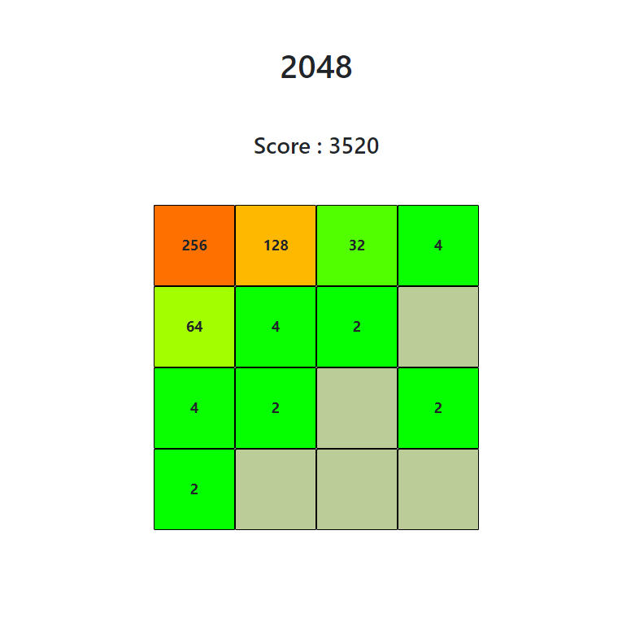
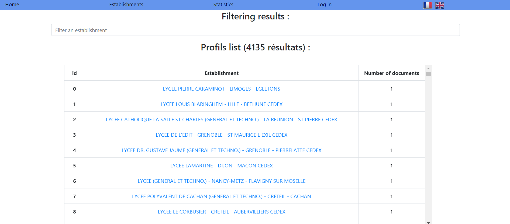

# Web-Development-Projects

This repository includes several projects of web application.
Those projects has been developped with programming languages HTML, CSS and Javascript for both **Calculatrice** and **Taquin** and React framework, NodeJS and MongoDB database for the **website**.They are part of self-training.

---

## 2048 game

### Description of the game

The folder **2048** includes the differents files (HTML, CSS and Javacript) which allows you to play the game 2048 :

- 2048.css
- 2048.html
- 2048.js.

The goal is for the player to merge identical cells (for example, 2 and 2 are merge into 4, 4 and 4 into 8 and so on) in order to reach the highest possible score and the highest possible cell's value (2048 is not a limit). The game ends when no moves are allow in any of the 4 directions.
Use the arrow keys in order to move the cells.

### Overview of the game

---

## Taquin game

### Description of the game

The folder **Taquin** includes the differents files (HTML, CSS and Javacript) which allows you to play the game :

- taquin.css
- taquin.html
- taquin.js.

The goal is for the player to sort the square by ascening order (defined by their number). The player can click on the square he wants to move or he can simply use the keys Z, Q, S and D to move the squares (respectively top, left, down and right).

### Overview of the game

---

## Calculator

## Description of the application

The folder **Calculatrice** includes the differents files (HTML, CSS and Javascript) which allows you to use the calculator :

- calculatrice.css
- calculatrice.html
- calculatrice.js.

The calculator alows you to compute some calculation with a simple calculator interface.

## Overview of the calculator

---

## Website

## Description of the application

The folder **website** includes the differents files, (frontend and backend) and explanations required to use and visualise data coming from an open source French gouvernment database regarding high schools grades and student numbers.

The appication is coded with framework **React** for frontend and **NodeJS** for backend. The data are inserted in a **MongoDB** database.

Open the folder website for more details about this application.

## Overview of the web application

