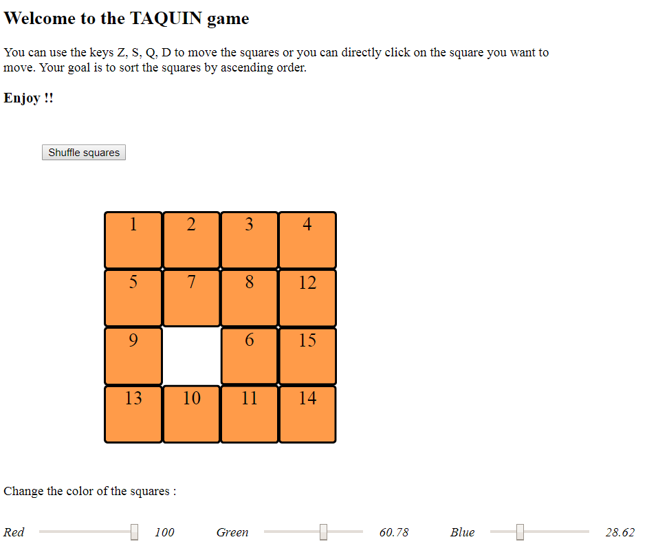
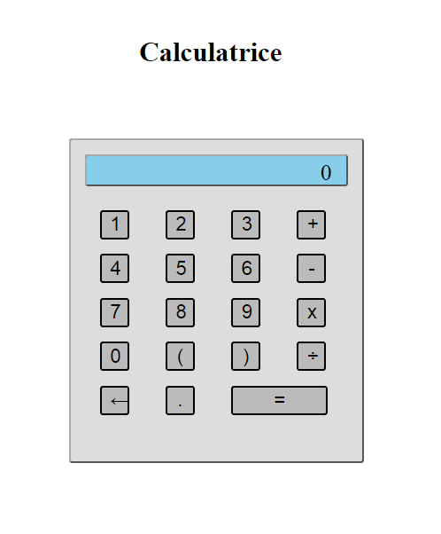

# Web-Development-Projects

This repository includes several projects of web application.
Those projects has been developped with programming languages HTML, CSS and Javascript for both **Calculatrice** and **Taquin** and React framework, NodeJS and MongoDB database for the **website**.They are part of self-training.

---

## Taquin game

### Description of the game

The folder **Taquin** includes the differents files (HTML, CSS and Javacript) which allow you to play the game :

- taquin.css
- taquin.html
- taquin.js.

The goal is for the player to sort the square by ascening order (defined by their number). The player can click on the square he wants to move or he can simply use the keys Z, Q, S and D to move the squares (respectively top, left, down and right).

### Overview of the game

---

## Calculator

## Description of the application

The folder **Calculatrice** includes the differents files (HTML, CSS and Javascript) which allow you to use the calculator :

- calculatrice.css
- calculatrice.html
- calculatrice.js.

The calculator alows you to compute some calculation with a simple calculator interface.

## Overview of the calculator

---

## Website

## Description of the application

The folder **website** includes the differents files and explanations required to use and visualise data coming from an open source French gouvernment database.
